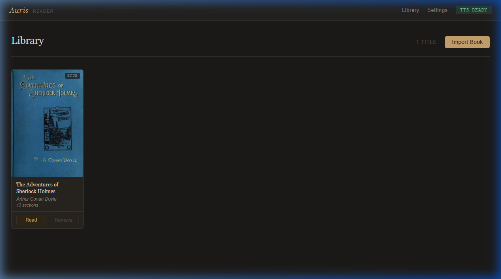
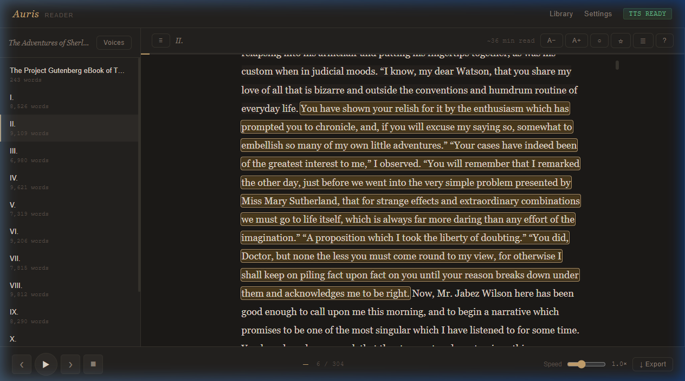
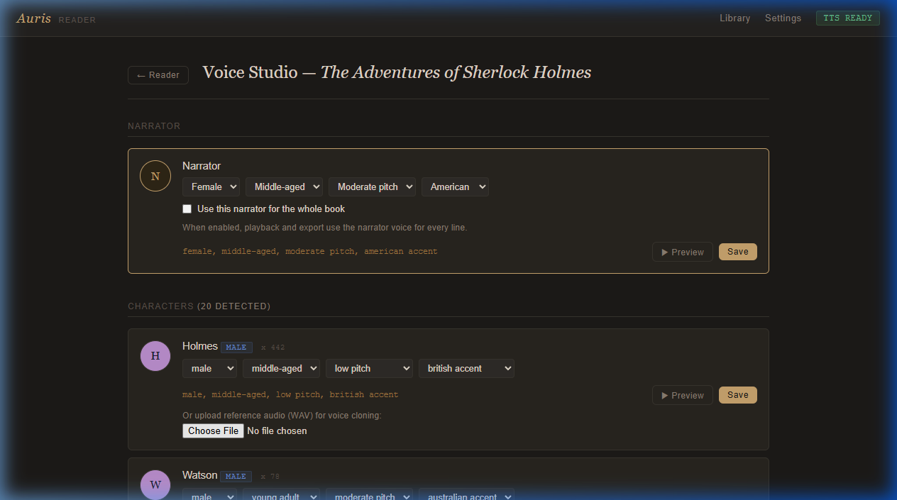
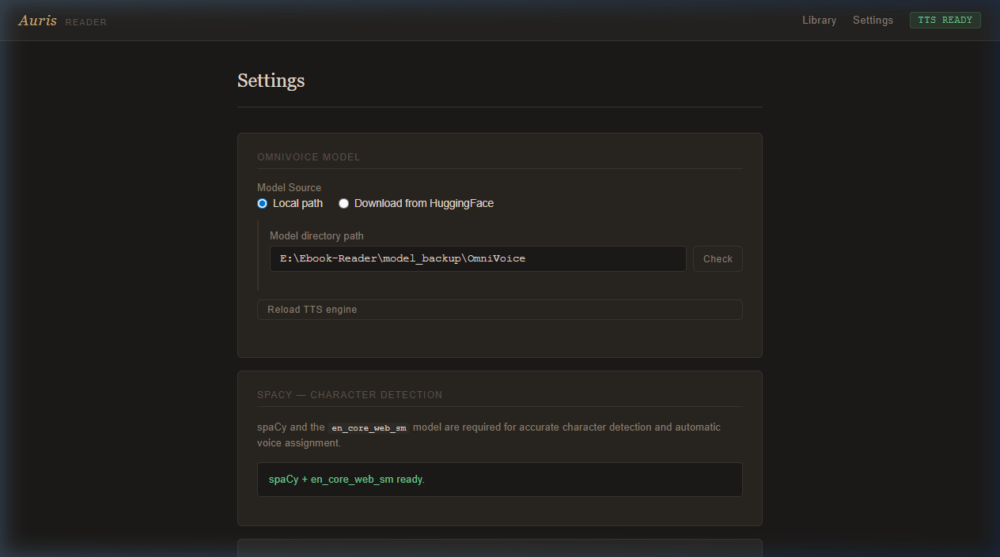

# Auris

Offline audiobook reader for EPUB, PDF, and TXT with local OmniVoice TTS, character-aware voices, per-book narrator control, and synced text highlighting.

Everything runs locally after setup. No API keys. No hosted TTS dependency.

## Screenshots

### Library


### Reader


### Voice Studio


### Settings


## Highlights

- Import EPUB, PDF, and TXT books.
- Detect chapters, prologues, epilogues, forewords, appendices, and parts automatically.
- Generate per-character voices with deterministic assignment.
- Customize each detected character in Voice Studio.
- Customize the narrator voice per book.
- Preview voices before saving.
- Upload reference WAV files for voice cloning.
- Invalidate stale cached playback automatically when narrator or character voices change.
- Export numbered, per-chapter audio as WAV or MP3 and subtitles as ASS or SRT.
- Select all chapters or use print-style selections such as `1,3,5-8`.
- Run from a project-local `.venv` created by the installer.

## Requirements

- Python 3.10 or later
- `ffmpeg` on `PATH` for MP3 export
- OmniVoice model files stored locally
- Optional NVIDIA GPU for faster inference

## Installation

```bash
git clone https://github.com/nikhilprasanth/Auris.git
cd Auris
```

Run the installer:

```bash
# Windows
reader\setup.bat

# Linux / macOS
bash reader/setup.sh
```

Or directly:

```bash
python reader/setup.py
```

The installer detects CUDA or CPU, creates `reader/.venv`, installs PyTorch, OmniVoice, spaCy, and the reader dependencies, then downloads the `en_core_web_sm` spaCy model when network access is available.

## Model setup

The OmniVoice weights are not bundled with this repository.

You can either:

- Download them from the Settings page using the built-in Hugging Face downloader.
- Point Settings at an existing local OmniVoice model directory.

The model directory must contain the files OmniVoice expects, such as `config.json` and model weights.

## Usage

1. Import a book from the library page.
2. Open the book and start playback from any sentence.
3. Open Voice Studio from the reader sidebar.
4. Adjust character voices or the narrator voice, preview them, then save.
5. Export the current chapter or select chapters with `all`, a range such as
   `2-6`, or a comma-separated expression such as `1,3,7-10`.

Multi-chapter exports are saved beneath `reader/exports/<book_title>/` with
numbered filenames, for example `01_Introduction.mp3`. When MP3 export succeeds,
the temporary WAV file is removed automatically.

On RTX 3090-class GPUs, leave **Settings → Parallel export workers** on
**Auto** or select **2**. Multi-chapter export then loads a second OmniVoice model
temporarily and runs two CUDA streams. If VRAM is insufficient or either
worker fails, Auris automatically continues on the primary model.

## Voice design caveats

OmniVoice does not produce clean output for every voice-design combination. The upstream docs note that some attribute mixes are unreliable, especially without reference audio.

The most fragile cases are youth voices with extreme pitch settings. For example, combinations like `male, teenager, very high pitch, american accent` can degrade into squeaks, bursts, or static instead of intelligible speech.

Auris now tries to stabilize some known-bad combinations during preview and playback by relaxing them to a nearby voice design, but this is still a model limitation, not something the UI can fully solve.

Best results:

- Prefer `young adult` over `teenager` when you do not have reference audio.
- Avoid `very high pitch` and `very low pitch` on `child` and `teenager` voices.
- Upload a clean WAV reference when you need a specific youthful voice.
- Preview before saving.

Reference: `https://github.com/k2-fsa/OmniVoice/blob/master/docs/voice-design.md`

## Offline installs

Local wheels are not used by default.

If you intentionally maintain your own wheel cache, opt in explicitly:

```bash
# Windows
set AURIS_USE_LOCAL_WHEELS=1
reader\setup.bat

# Linux / macOS
AURIS_USE_LOCAL_WHEELS=1 bash reader/setup.sh
```

For a strict offline install:

```bash
# Windows
set AURIS_OFFLINE=1
set AURIS_WHEELS_DIR=E:\path\to\wheels
reader\setup.bat

# Linux / macOS
AURIS_OFFLINE=1 AURIS_WHEELS_DIR=/path/to/wheels bash reader/setup.sh
```

## Project structure

```text
Auris/
|-- README.md
|-- LICENSE
|-- wheels/          ← offline wheel cache (optional)
`-- reader/
    |-- app.py
    |-- setup.py     ← cross-platform installer (called by setup.bat / setup.sh)
    |-- setup.bat    ← Windows installer
    |-- setup.sh     ← Linux / macOS installer
    |-- run.bat      ← Windows launcher
    |-- run.sh       ← Linux / macOS launcher
    |-- requirements.txt
    |-- core/
    |-- static/
    |-- templates/
    `-- data/
```

## Main dependencies

- OmniVoice
- Flask
- ebooklib
- PyMuPDF
- spaCy
- pydub
- soundfile
- PyTorch

## Roadmap

### Small language model for emotion classification

The current enrichment pipeline uses regex patterns to decide which non-verbal tag (`[laughter]`, `[surprise-wa]`, `[question-ei]`, etc.) to inject before each TTS segment. It works well when attribution verbs are present in the text ("she gasped", "he scoffed"), but it cannot understand tone, irony, or context that isn't signalled by a keyword.

The plan is to connect to any OpenAI-compatible language model endpoint as an emotion classifier between parsing and TTS synthesis:

- **Connection:** a configurable base URL and API key in Settings, compatible with any OpenAI-spec server — local (Ollama, LM Studio, llama.cpp server) or remote. No runtime library bundled with Auris; the standard `openai` Python client is the only dependency.
- **Model candidates:** **Qwen3-0.8B** (fastest, lowest RAM), **Qwen3-2B** (better reasoning, still lightweight), **Gemma 4 E2B** (Google's 2B edge model), **LFM2.5-1.2B-Instruct** (Liquid AI — strong reasoning efficiency per parameter). Any model the user serves behind an OpenAI-compatible endpoint will work.
- **Input:** the current segment text plus one sentence of surrounding context.
- **Output:** a single tag from the supported set, or `none`. Structured output / JSON mode keeps latency low and parsing trivial.
- **Fallback:** the existing regex engine remains as a zero-latency fallback when no endpoint is configured or the model returns an invalid response.
- **Integration point:** `core/enrichment.py` — the `_select_expression_tag` function would be replaced by a call to the classifier, with the regex result used as a hint in the prompt.
- **UX:** base URL, API key, and model name are set in Settings. Leaving the base URL blank keeps regex-only mode active.

This would fix the main remaining gap: narration sentences that carry emotional weight without any keyword signal, and multi-emotion moments where the current system can only pick one tag.

## License

MIT. See [LICENSE](LICENSE).
