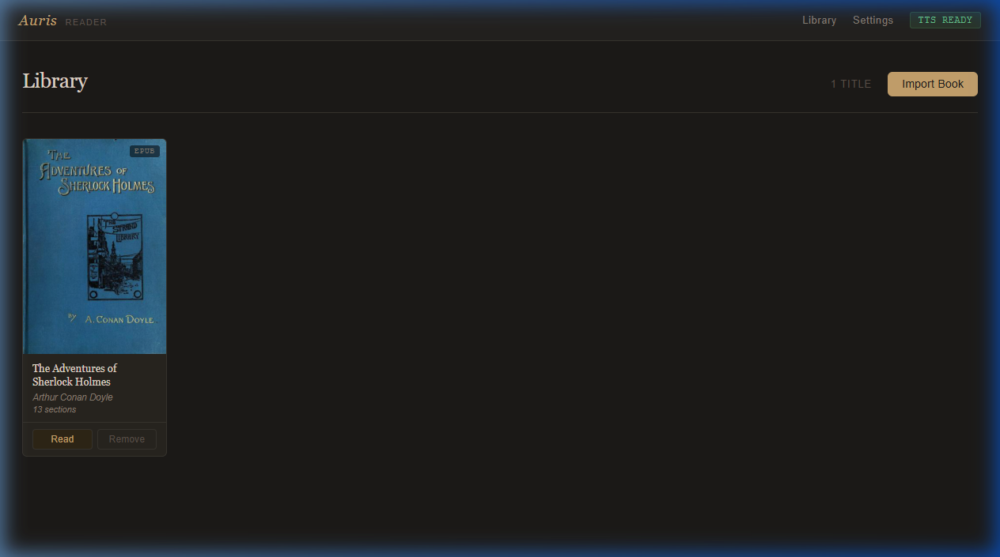
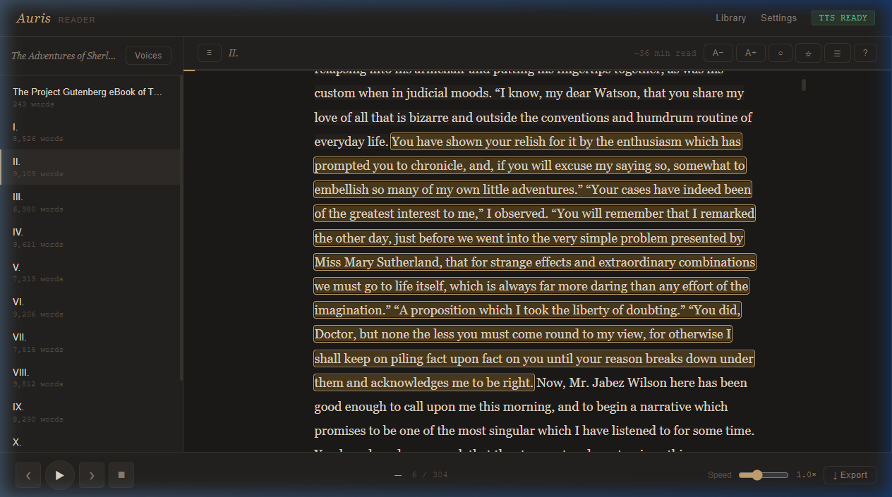
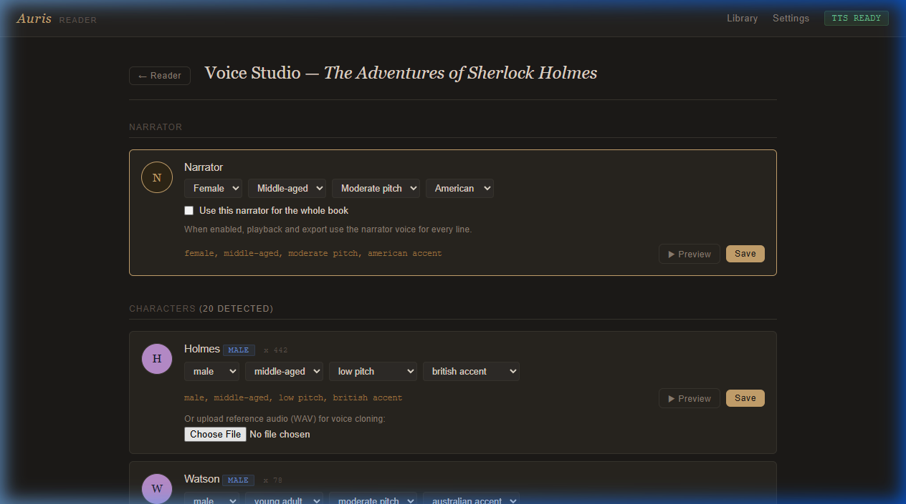
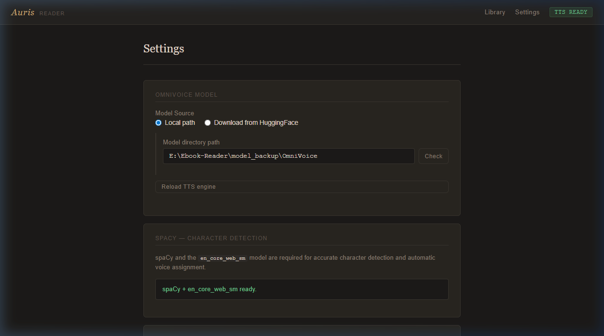

# Auris

[](https://github.com/mp3pintyo/Auris/releases/latest)

Current version: [`VERSION`](VERSION). See the complete bilingual
[`CHANGELOG.md`](CHANGELOG.md) and the [`RELEASING.md`](RELEASING.md) guide for
the versioning and release process.

Local-first audiobook reader for EPUB, PDF, DOCX, TXT, PRC/MOBI, and public web articles with selectable local
OmniVoice or Higgs TTS 3 speech, character-aware voices, per-book narrator
control, and duration-based estimated word highlighting.

Reading, speech generation, playback, and file import run locally after setup,
with no hosted TTS dependency. Web-article import requires a network connection.
Character analysis can use a local OpenAI-compatible server without a key, or
the optional OpenAI API with a separately billed API key.

## Screenshots

These images show the earlier layout. The current interface uses Hungarian
labels and the updated workflows described below and in the built-in help.

### Library


### Reader


### Voice Studio


### Settings


## Highlights

- Preview and import EPUB, PDF, DOCX, TXT, DRM-free PRC/MOBI, or a public HTTP(S) article; edit title,
  author, and language before confirming.
- Split DOCX books by Word heading styles when the document provides them.
- Extract web articles with Trafilatura. Auris does not run page JavaScript and
  blocks localhost, private-network, oversized, and excessive-redirect URLs.
- Detect duplicate source content with SHA-256 while keeping same-named uploads
  in distinct managed files.
- Detect chapters, prologues, epilogues, forewords, appendices, and parts automatically.
- Generate per-character voices with deterministic assignment.
- Attribute dialogue to characters with OpenAI or a configurable local LM
  Studio, Ollama, llama.cpp, or other OpenAI-compatible endpoint.
- Customize each detected character in Voice Studio.
- Customize the narrator voice per book.
- Save reusable narrator/character voice profiles with durable reference audio;
  transfer profiles between Auris installations as `.aurisvoice` files.
- Apply global or per-book pronunciation rules without changing displayed text.
- Preview voices with your own Hungarian sample text and save the result as WAV.
- Upload reference WAV files for voice cloning.
- Invalidate stale cached playback automatically when narrator or character voices change.
- Search within a book, jump 15 seconds, use a sleep timer, and control playback
  through Media Session where the browser supports it.
- Track generation, export, and reanalysis on the durable Jobs page; cancelled or
  restart-interrupted work resumes only when requested and reuses valid cached audio.
- Export numbered, per-chapter audio as WAV or MP3, or one chaptered M4B;
  subtitles can be ASS, SRT, or omitted.
- Select all chapters or use print-style selections such as `1,3,5-8`.
- Save and restore the library as an Auris ZIP, optionally including the
  regenerable audio cache. Restore replaces the library after confirmation and
  first writes a recovery backup; stale jobs from the replaced library are cleared.
- Inspect generated audio-cache usage and remove old files that no book references.
- Run from a project-local `.venv` created by the installer.

## Requirements

- Python 3.10 or later
- `ffmpeg` on `PATH` for MP3, M4B, and export mastering
- OmniVoice model files stored locally
- Optional NVIDIA GPU for faster inference

## Installation

```bash
git clone https://github.com/nikhilprasanth/Auris.git
cd Auris
```

Run the installer:

```bash
# Windows
reader\setup.bat

# Linux / macOS
bash reader/setup.sh
```

Or directly:

```bash
python reader/setup.py
```

The installer detects CUDA or CPU, creates `reader/.venv`, installs PyTorch, OmniVoice, spaCy, and the reader dependencies, then downloads the `en_core_web_sm` spaCy model when network access is available.

## Model setup

The OmniVoice weights are not bundled with this repository.

You can either:

- Download them from the Settings page using the built-in Hugging Face downloader.
- Point Settings at an existing local OmniVoice model directory.

The model directory must contain the files OmniVoice expects, such as `config.json` and model weights.

### Higgs TTS 3

Select **Higgs TTS 3 — 4B** in Settings to try the Boson AI model. Auris uses
the Transformers-compatible
`multimodalart/higgs-audio-v3-tts-4b-transformers` adapter and downloads its
model files into the HuggingFace cache on first load. You can also point the
Higgs section at a compatible local snapshot.

Higgs and OmniVoice keep separate settings and run with separate Transformers
versions. The installer puts Higgs' Transformers 5.13 runtime in
`reader/.higgs_runtime`; OmniVoice remains on its compatible 5.3 release.

Higgs supports Hungarian, transcript-assisted zero-shot voice cloning, and
inline emotion, style, prosody, pause, and sound-effect controls. Auris maps its
existing scene speed and expression tags to those controls.

Higgs has its own research/non-commercial license with a creator-use grant.
Audiobooks and similar creator media require prominent Boson AI Higgs Audio
attribution, and voice cloning requires the speaker's consent. Review the
[official model card](https://huggingface.co/bosonai/higgs-tts-3-4b) before use.

## Usage

1. Choose a file or public article URL on the library page, review the preview,
   then confirm the metadata and narration mode.
2. Open the book and start playback from any sentence.
3. Open Voice Studio from the reader sidebar.
4. Adjust character voices or the narrator voice, preview them, then save.
5. Export the current chapter or select chapters with `all`, a range such as
   `2-6`, or a comma-separated expression such as `1,3,7-10`. Choose WAV, MP3,
   or chaptered M4B and optionally ASS/SRT subtitles.

Scanned PDFs and images can use optional local Tesseract OCR from the library's
import options, with an explicit recognition language (Hungarian: `hun`). Install
Tesseract and the required language data separately. Native PDF text is retained;
only pages without text are recognized. Optional Calibre `ebook-convert` adds
AZW/AZW3, FB2, RTF, ODT, HTML, DOC and LRF import. Both tools are detected on PATH
and in their standard Windows Program Files folders. Empty documents are rejected.

The built-in Hungarian help, **OCR és Calibre → Windows: telepítés lépésről
lépésre**, includes Windows installation commands, Hungarian language data,
PATH setup, verification commands, restart instructions and troubleshooting for
Tesseract, Calibre, FFmpeg and ffprobe (`/docs#import-tools`).

M4B export now streams audio to disk, embeds cover art and extended book metadata,
applies optional mastering, and verifies chapters/duration with ffprobe before
publishing the finished file. Resume points include the time within a sentence
and reset that offset when its audio variant changes.

Daily/weekly library backups run while Auris is open, without audio cache. Configure
retention (1–100) in Settings, download completed archives there, and inspect the
last success/error. Missed runs catch up after startup; busy/failed attempts retry
after five minutes. Only managed automatic archives are pruned after success.

Library backups include managed sources, reference audio, bookmarks, progress,
speaker corrections, pronunciation rules, and portable settings. API keys and
machine-specific model paths are excluded. Restoring is a confirmed replacement,
not a merge, and preserves the current machine's keys and model paths.

### Language-model character detection

Open **Settings → Characters & narrator**, enable **Language model**, then choose
either a local OpenAI-compatible server or the OpenAI API.

For OpenAI, add an API key, use **Load models**, and select one of the text models
available to the account. ChatGPT subscriptions and OpenAI API billing are
separate; using this integration requires API access and is billed through the
OpenAI API account.

For a local server, enter its base URL and load the served models. Typical URLs
are:

- LM Studio: `http://127.0.0.1:1234/v1`
- Ollama: `http://127.0.0.1:11434/v1`

For the LM Studio test configuration used during development:

- served model: `unsloth/gemma-4-26b-a4b-it`
- LM Studio context length: `160000` tokens
- Auris request timeout: `600` seconds
- maximum stored characters: `60`
- API key: empty for a normal local server

The context length is configured in LM Studio or Ollama, not in Auris. Auris
deliberately sends one chapter per request because the size of the structured
speaker-assignment response, rather than the model's input context, is normally
the limiting factor.

Recommended setup:

1. Start the local server and load the language model.
2. Open **Settings → Characters & narrator**.
3. Select **Language model — recommended** and the **Local server** provider.
4. Enter the base URL and use **Load models** to select the served model.
5. Set the request timeout and maximum character count. Add an API key only if
   the local server requires one.
6. Use **Test connection**, save the settings, and then import the book.

Character and dialogue-speaker analysis is a durable background job.
For a local language model, Auris unloads the selected TTS engine first so the
two models do not compete for VRAM. OpenAI analysis leaves local TTS running.
Auris sends numbered text units chapter by chapter,
builds a canonical character roster, and stores every dialogue-to-speaker
assignment with the book. The reader, Voice Studio, playback, and export then
reuse those stored assignments; the TTS engine is loaded lazily only when it is
next needed. If an individual chapter fails, successful chapter results are
kept and the book is marked as partially analyzed instead of discarding the
whole run.

To update an existing book, use **Szereplők újraelemzése** in its library details.
You can reanalyze the full book, selected chapters through the API, or retry only
failed chapters. Manual speaker corrections, voice settings, bookmarks, and the
current reading position are retained; when segment boundaries change, Auris
remaps positions to matching text where possible.

The **Feladatok** page keeps job status, progress, errors, and downloads in
SQLite. Restarted pending/running jobs become **Megszakadt** and never restart a
language model or paid API automatically. **Folytatás / újrapróbálás** is the
explicit action that resumes from valid cached results. Cancellation is
cooperative, so the currently running batch may finish before new work stops.

The two files in `test_docs/` were measured end to end against LM Studio with
`unsloth/gemma-4-26b-a4b-it` and a 160,000-token server context:

| Test document | Chapters | Dialogue candidates | Speaker assigned | Coverage | Chapter errors | Elapsed |
| --- | ---: | ---: | ---: | ---: | ---: | ---: |
| `Rejto_Jeno-14-karatos-auto.pdf` | 21 | 2,063 | 1,845 | 89.4% | 0 | 6m 36s |
| `14Carat.txt` | 21 | 1,395 | 1,350 | 96.8% | 0 | 7m 56s |

These figures describe the tested model and documents, not a guaranteed score
for every book. Dialogue style, OCR/text extraction quality, model choice, and
model quantization can all change the result. The legacy English-oriented
spaCy/regex detector remains available as a fallback mode.

Exports are saved beneath `reader/exports/<author> - <book_title>/` with
numbered filenames, for example `01_Introduction.mp3`. When MP3 export succeeds,
the temporary WAV file is removed automatically.

Word highlighting is estimated from each segment's known audio duration; Auris
does not run a word-alignment model. The remaining-time display is marked
`kb.` when some audio still needs a word-count estimate. Browser Media Session
support improves headset/media-button control where available, but background
playback on every mobile platform is not guaranteed.

On RTX 3090-class GPUs, leave **Settings → Parallel export workers** on
**Auto** or select **2**. Multi-chapter export then loads a second OmniVoice model
temporarily and runs two CUDA streams. If VRAM is insufficient or either
worker fails, Auris automatically continues on the primary model.

## Inference acceleration and benchmarking

For reproducible OmniVoice performance measurements, run from the repository root:

```powershell
reader\.venv\Scripts\python.exe scripts\benchmark_tts.py --output reader/data/performance/run.json
```

The benchmark generates real Hungarian audio without audio-cache hits, records
first-call latency separately from five warm runs, and saves JSON plus WAV samples.
Use `--ref-audio reference.wav --ref-text transcript.txt` for voice cloning.
It does not save changes to application settings.

Acceleration **Auto** selects CUDA Graph on NVIDIA and optimized PyTorch on
AMD ROCm, Apple MPS and CPU. **Off** still uses the available GPU. Triton/hybrid
is an explicit experimental NVIDIA option. Variable-length audio no longer enables
cuDNN's costly convolution algorithm search. See the built-in **Documentation →
Performance** and [measurement report](docs/performance/2026-09-10-tts.md).

AMD users must first install the GPU/OS/Python-compatible torch and torchaudio
pair from [AMD's ROCm instructions](https://rocm.docs.amd.com/projects/radeon-ryzen/en/latest/).
The installer preserves a working ROCm runtime; it does not choose AMD wheels
automatically. NVIDIA/Windows was measured locally; the updated ROCm/MPS paths
still require physical-device validation. These acceleration modes apply to
OmniVoice, not the separate Higgs engine.

## Voice design caveats

OmniVoice does not produce clean output for every voice-design combination. The upstream docs note that some attribute mixes are unreliable, especially without reference audio.

The most fragile cases are youth voices with extreme pitch settings. For example, combinations like `male, teenager, very high pitch, american accent` can degrade into squeaks, bursts, or static instead of intelligible speech.

Auris now tries to stabilize some known-bad combinations during preview and playback by relaxing them to a nearby voice design, but this is still a model limitation, not something the UI can fully solve.

Best results:

- Prefer `young adult` over `teenager` when you do not have reference audio.
- Avoid `very high pitch` and `very low pitch` on `child` and `teenager` voices.
- Upload a clean WAV reference when you need a specific youthful voice.
- Preview before saving.

Reference: `https://github.com/k2-fsa/OmniVoice/blob/master/docs/voice-design.md`

## Offline installs

Local wheels are not used by default.

If you intentionally maintain your own wheel cache, opt in explicitly:

```bash
# Windows
set AURIS_USE_LOCAL_WHEELS=1
reader\setup.bat

# Linux / macOS
AURIS_USE_LOCAL_WHEELS=1 bash reader/setup.sh
```

For a strict offline install:

```bash
# Windows
set AURIS_OFFLINE=1
set AURIS_WHEELS_DIR=E:\path\to\wheels
reader\setup.bat

# Linux / macOS
AURIS_OFFLINE=1 AURIS_WHEELS_DIR=/path/to/wheels bash reader/setup.sh
```

## Project structure

```text
Auris/
|-- README.md
|-- LICENSE
|-- wheels/          ← offline wheel cache (optional)
`-- reader/
    |-- app.py
    |-- setup.py     ← cross-platform installer (called by setup.bat / setup.sh)
    |-- setup.bat    ← Windows installer
    |-- setup.sh     ← Linux / macOS installer
    |-- run.bat      ← Windows launcher
    |-- run.sh       ← Linux / macOS launcher
    |-- requirements.txt
    |-- core/
    |-- static/
    |-- templates/
    `-- data/
```

## Main dependencies

- OmniVoice
- Flask
- ebooklib
- PyMuPDF
- python-docx
- Trafilatura
- spaCy
- pydub
- soundfile
- PyTorch

## Roadmap

### Small language model for emotion classification

The current enrichment pipeline uses regex patterns to decide which non-verbal tag (`[laughter]`, `[surprise-wa]`, `[question-ei]`, etc.) to inject before each TTS segment. It works well when attribution verbs are present in the text ("she gasped", "he scoffed"), but it cannot understand tone, irony, or context that isn't signalled by a keyword.

The plan is to connect to any OpenAI-compatible language model endpoint as an emotion classifier between parsing and TTS synthesis:

- **Connection:** a configurable base URL and API key in Settings, compatible with any OpenAI-spec server — local (Ollama, LM Studio, llama.cpp server) or remote. No runtime library bundled with Auris; the standard `openai` Python client is the only dependency.
- **Model candidates:** **Qwen3-0.8B** (fastest, lowest RAM), **Qwen3-2B** (better reasoning, still lightweight), **Gemma 4 E2B** (Google's 2B edge model), **LFM2.5-1.2B-Instruct** (Liquid AI — strong reasoning efficiency per parameter). Any model the user serves behind an OpenAI-compatible endpoint will work.
- **Input:** the current segment text plus one sentence of surrounding context.
- **Output:** a single tag from the supported set, or `none`. Structured output / JSON mode keeps latency low and parsing trivial.
- **Fallback:** the existing regex engine remains as a zero-latency fallback when no endpoint is configured or the model returns an invalid response.
- **Integration point:** `core/enrichment.py` — the `_select_expression_tag` function would be replaced by a call to the classifier, with the regex result used as a hint in the prompt.
- **UX:** base URL, API key, and model name are set in Settings. Leaving the base URL blank keeps regex-only mode active.

This would fix the main remaining gap: narration sentences that carry emotional weight without any keyword signal, and multi-emotion moments where the current system can only pick one tag.

## License

The Auris source is MIT. See [LICENSE](LICENSE). Models retain their own
licenses; in particular, Higgs TTS 3 is not distributed under the Auris MIT
license.
